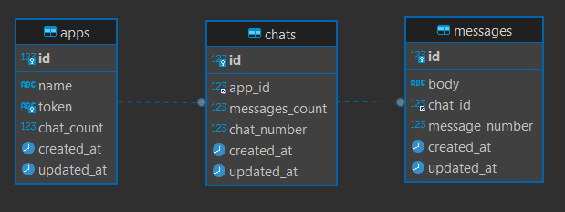

# Chat System: Design and Implementation

## Quick Start

To run the entire stack, simply use:

```bash
docker-compose up --build
```

if the bash closed with error 'service X is unhelathy' so please run the command docker-compose up again after few seconds,its happens sometimes because the dependencies

## Test

by default the main rails server will run on

```
http://localhost:3000
```

and go server `for create chat and create message` will run on

```
http://localhost:8080
```

see the endpoints section below for all available requests and the parameters or body for each request

## System Overview

This application is a chat system designed to efficiently manage chats and messages for multiple applications. The system uses a Rails server with Sidekiq for background job processing, Redis for atomic operations and concurrency control, and Elasticsearch for advanced search capabilities.<br><br>
Additionally, a Go server running on port `8080` has been implemented to handle `create chat` and `create message` requests. The Rails server (on port `3000`) still supports these endpoints, but the Go server processes them faster. Both implementations share the same behavior:

- Retrieve the next `chat_number` or `message_number` from Redis with atomic updates to prevent race conditions.
- Return the generated number to the client.
- Push the creation request to a background job for further processing.

---

## System Design

### Backend Architecture

the main part of the system founded in app/models , app/controllers , config/initializers

the background workers founded in app/sidekiq

- **Rails Server**: Handles API requests and coordinates operations.
- **Go Server**: Optimized for handling `create chat` and `create message` requests at faster speeds.

- **Sidekiq**: Manages background jobs, such as creating chats and messages, and updating counters asynchronously.
- **Redis**:
  - Used to store atomic counters for generating unique `chat_number` (per app) and `message_number` (per chat).
  - Ensures concurrency control during simultaneous requests.
- **Elasticsearch**: Provides support for partial and proximity search for messages.

---

### Workflow

1. **Unique Identifiers**:
   - Upon initialization, the system preloads the number of existing chats per app and messages per chat from the database.
   - Redis atomic operations generate unique `chat_number` and `message_number` to avoid race conditions.
2. **Chat Creation**:
   - **Step 1**: The main server (Rails or Go) uses Redis to create a unique `chat_number` and atomically increment it. It then returns the `chat_number` to the client and pushes the creation request into the message queue.
   - **Step 2**: The background job receives the creation request, creates the chat entity in the database, and increments the `chat_number` in the database.
3. **Message Creation**:
   - Users specify the chat via app token and `chat_number`.
   - A unique `message_number` is generated and stored in Redis.
   - The system increments the message counter for the chat asynchronously.
4. **Partial Search**:
   - Elasticsearch is used to find messages that closely match the user query within a specific chat or across the entire system.

---

## Database Design

### Entities and Relationships



you could see all of it in ./db/migrate

1. **App**: Represents an application with chats and messages.
   - `id` (Primary Key)
   - `token` (Unique, indexed for fast search)
   - `name`
   - `chat_count` (Default: 0)
2. **Chat**: Represents a conversation linked to an app.
   - `id` (Primary Key)
   - `app_id` (Foreign Key, indexed for search)
   - `chat_number` (Unique per app, indexed)
   - `messages_count` (Default: 0)
3. **Message**: Represents messages in a chat.
   - `id` (Primary Key)
   - `chat_id` (Foreign Key, indexed for search)
   - `message_number` (Unique per chat, indexed)
   - `body`

### Indexes

- **Apps Table**:
  - `token`: Optimizes lookup by app token.
- **Chats Table**:
  - Composite index on `[app_id, chat_number]`: Ensures uniqueness and speeds up searches.
  - `app_id`: Optimizes searches by app.
- **Messages Table**:
  - Composite index on `[chat_id, message_number]`: Ensures message uniqueness within a chat.
  - `chat_id`: Optimizes retrieval of messages by chat.

## API Endpoints

you could find add endpoints in file ./config/routes.rb.
<br><br>
in the following all endpoints available with the required body and expected response in JSON format, note that if the body does not specify in any endpoint it is not needed any body in this endpoint

### apps

- **POST /apps/**: Create a new application,default chat_count=0.
  - **Request Body**:
    ```json
    {
      "app": {
        "name": "app name"
      }
    }
    ```
  - **Response**:
    ```json
    {
      "token": "32 byte app token",
      "name": "app name",
      "chat_count": 0
    }
    ```
- **GET /apps/:token**: Retrieve application details (name, chat count).
  - **Response**:
    ```json
    {
      "name": "app name",
      "chat_count": 2
    }
    ```
- **PATCH /apps/:token**: Update the application name.
  - **Request Body**:
    ```json
    {
      "app": {
        "name": "this is the new name"
      }
    }
    ```
  - **Response**:
    ```json
    {
      "name": "this is the new name",
      "chat_count": 0
    }
    ```
- **GET /apps**: Retrieve all application details (name, chat count).
  - **Response**:
    ```json
    [
      {
        "name": "app 1 name",
        "token": "32 byte token",
        "chat_count": 3
      },
      {
        "name": "app 2 name",
        "token": "32 byte token",
        "chat_count": 2
      }
    ]
    ```

### Chats

- **POST /apps/:app_token/chats**: Create a new chat under a specific app, default message_count=0,return the created chat_number.
  - **Response**:
    ```json
    {
      "chat_number": 1
    }
    ```
- **GET /applications/:token/chats**: Retrieve all chats for a specific app.
  - **Response**:
    ```json
    [
      {
        "chat_number": 1
      },
      {
        "chat_number": 2
      }
    ]
    ```
- **GET /chats**: Retrieve all chats across the system.
  - **Response**:
    ```json
    [
      {
        "chat_number": 1,
        "messages_count": 0,
        "app_token": "32 byte app 1 token"
      },
      {
        "chat_number": 2,
        "messages_count": 0,
        "app_token": "32 byte app 1 token"
      },
      {
        "chat_number": 3,
        "messages_count": 0,
        "app_token": "32 byte app 1 token"
      },
      {
        "chat_number": 1,
        "messages_count": 0,
        "app_token": "32 byte app 2 token"
      },
      {
        "chat_number": 2,
        "messages_count": 0,
        "app_token": "32 byte app 2 token"
      }
    ]
    ```

### Messages

- **POST /apps/:app_token/chats/:chat_number/messages**: Create a new message in a chat.
  - **Request Body**:
    ```json
    {
      "message": {
        "body": "ahmed want to go to home"
      }
    }
    ```
  - **Response**:
    ```json
    {
      "message_number": 5
    }
    ```
- **GET /apps/:app_token/chats/:chat_number/messages?query="text"**: Perform a partial search within a chat using Elasticsearch,if the user doesn't pass the query then the response will Retrieve all messages in a specific chat with matching_score=0.
  - **Response**:
    ```json
    [
      {
        "matching_score": 3.7836456,
        "body": "ahmed want to go to home",
        "message_number": 5
      },
      {
        "matching_score": 0.57843524,
        "body": "yasser play football",
        "message_number": 1
      }
    ]
    ```
- **GET /messages**: Retrieve all messages across the system.

  - **Response**:

    ```json
    [
      {
        "app_token": "32 byte app token",
        "chat_number": 1,
        "message_number": 1,
        "body": "text"
      },
      {
        "app_token": "32 byte app token",
        "chat_number": 2,
        "message_number": 3,
        "body": "text"
      }
    ]
    ```

---

## Redis Implementation

Redis ensures atomic operations to generate unique numbers:

1. **Initialization**:
   - Load chat and message counts into Redis on startup.
2. **Concurrency Control**:
   - Increment chat and message counters atomically.
   - Prevent race conditions during simultaneous requests.

---

## Elasticsearch Integration

- **Search Capabilities**:
- Partial and proximity search for messages.
- Query-based filtering at the chat.

---

## Setup and Deployment

1. **Database**:

- Use MySQL (Docker setup provided).
- Set up necessary indexes for optimization.

2. **Redis**:

- Build and run the Redis container.

3. **Sidekiq**:

- Configure for background job processing.

4. **Elasticsearch**:

- Ensure Elasticsearch is running for search endpoints.

---

## Future Enhancements

- add cashing for all data requested to return direct when asked again
- Enhanced analytics and reporting.
- API rate-limiting for better control.

## problems

- app_token collision not handled "very rare because it is 32 bytes"
- redis initializes loading in RAM for all app.chat_count by app token and all chat.message_count by app_token+chat_number, if there are too many records, redis or the whole system may crash
- In creating a chat request, the system gets the next unused chat_number of "specific app" from atomic RAM storage and returns it to the client and the background worker will handle the actual creation asynchronously, but if the background worker fails due to internal issues or duplicate chat_number or any other reason, there will be a problem because the user will assume that this chat_number is the creator, and this chat_number will be cached in redis but it will not appear in the actual database

```

```
